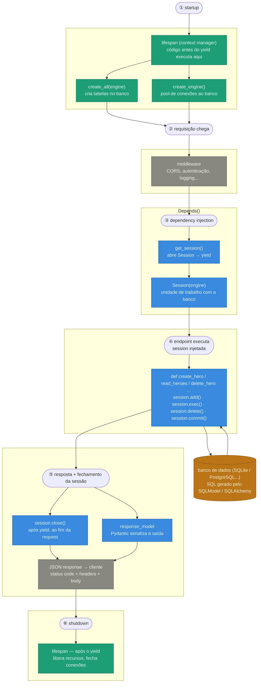

+++
title = "O ciclo de vida de uma aplicação FastAPI — e por que ignorar isso quebra produção"
date = 2025-04-14
description = "A maioria dos devs sobe uma API FastAPI e vai direto para os endpoints. Mas antes de qualquer requisição chegar, muita coisa acontece — e entender esse fluxo separa uma API que funciona no localhost de uma que aguenta produção de verdade."
draft = false
+++

Quando você sobe um servidor FastAPI, muita coisa acontece antes de qualquer requisição chegar. E muito mais acontece depois que ela vai embora.

Entender esse fluxo é o que separa uma API que "funciona no localhost" de uma que aguenta produção de verdade.

---

## Visão geral do fluxo



---

## O ciclo completo — do boot ao shutdown

### 1. Startup — o motor liga

Antes da primeira requisição, o FastAPI executa o bloco de **startup** do `lifespan`. É aqui que tudo que a aplicação precisa para funcionar deve ser inicializado:

- A engine de banco de dados é criada (`create_engine`) — **uma única vez**
- As tabelas são verificadas (`create_all`)
- O middleware é configurado (CORS, logs, autenticação)

Se o banco estiver inacessível, você quer saber **agora**, não na primeira requisição do seu usuário.

```python
@asynccontextmanager
async def lifespan(app: FastAPI):
    # startup
    await verify_db_connection()
    yield
    # shutdown
    await engine.dispose()
```

---

### 2. Requisição chega — o middleware age primeiro

Toda requisição passa pelo **middleware** antes de chegar ao seu endpoint. É aqui que você:

- Valida headers de autenticação
- Registra logs de acesso
- Bloqueia origens não autorizadas (CORS)

O middleware não é opcional — é a primeira linha de defesa da sua API.

---

### 3. Dependency Injection — `get_session()` entra em cena

O FastAPI cria uma **sessão de banco de dados isolada** para aquela requisição através do sistema de dependências:

```python
async def get_session() -> AsyncGenerator[AsyncSession, None]:
    async with AsyncSessionLocal() as session:
        try:
            yield session
            await session.commit()
        except Exception:
            await session.rollback()
            raise
        finally:
            await session.close()  # sempre fechada, inclusive em erros
```

A sessão é injetada automaticamente no seu endpoint e **garantidamente fechada** ao final — mesmo que uma exceção aconteça no meio do caminho.

Esse detalhe parece pequeno. Em produção com tráfego, é a diferença entre uma API estável e uma que vai caindo aos poucos por vazamento de conexões.

---

### 4. Seu endpoint executa

Com a sessão pronta e as dependências resolvidas, seu endpoint finalmente roda:

- Recebe os dados já **validados pelo Pydantic**
- Executa a lógica de negócio
- Retorna um `response_model` tipado

---

### 5. Shutdown — limpeza garantida

Quando a aplicação encerra (deploy, restart, SIGTERM), o FastAPI executa o bloco após o `yield` no `lifespan`:

- Conexões de banco são fechadas corretamente
- Modelos de ML são descarregados da memória
- Conexões Redis são encerradas

Nada fica pendurado. Nenhum processo órfão. Nenhuma conexão aberta no banco apontando para um servidor que não existe mais.

---

## Por que isso importa em produção?

Parece teoria, mas cada ponto tem uma consequência prática muito concreta:

**Sessões de banco bem gerenciadas** evitam connection pool esgotado. Sem isso, com 50 requisições simultâneas cada uma abrindo sua própria engine, você pode chegar facilmente a 750 conexões abertas no PostgreSQL — e o banco começa a recusar novas conexões.

**Middleware centralizado** garante que lógica transversal (autenticação, logs, CORS) não vaza para dentro dos endpoints. Endpoints só devem fazer uma coisa.

**Dependency Injection por-request** garante isolamento entre requisições. Sem isso, você corre o risco de uma sessão SQLAlchemy ser compartilhada entre threads — e SQLAlchemy Session não é thread-safe.

**Shutdown correto** evita dados corrompidos em deploys. Transações em andamento têm chance de completar. Conexões são encerradas de forma limpa.

---

## O erro mais comum que vejo

Devs abrindo sessão de banco **dentro do endpoint**, sem garantia de fechar:

```python
# não faça isso
@router.get("/users")
def list_users():
    engine = create_engine(DATABASE_URL)  # nova engine por request!
    session = Session(engine)
    return session.query(User).all()
    # sessão nunca é fechada
```

Em desenvolvimento, funciona. Em produção com volume, isso vira vazamento de conexão — e a aplicação vai caindo aos poucos enquanto você tenta entender o que está acontecendo.

A solução é um simples `get_session()` como dependência:

```python
@router.get("/users", response_model=list[UserResponse])
async def list_users(session: AsyncSession = Depends(get_session)):
    result = await session.execute(select(User))
    return result.scalars().all()
```

---

## Resumo

O ciclo de vida do FastAPI não é detalhe de documentação. É o contrato de estabilidade da sua aplicação.

Entender o fluxo uma vez — startup, middleware, dependency injection, endpoint, shutdown — muda a forma como você escreve cada linha de código. Você para de pensar em "fazer funcionar" e começa a pensar em "funcionar sob carga".

Se você nunca estudou o `lifespan` a fundo, esse é o próximo passo. Não é complexo. É só entender o fluxo uma vez.

---

*Encontrou um problema parecido no seu projeto? Me conta nos comentários.*